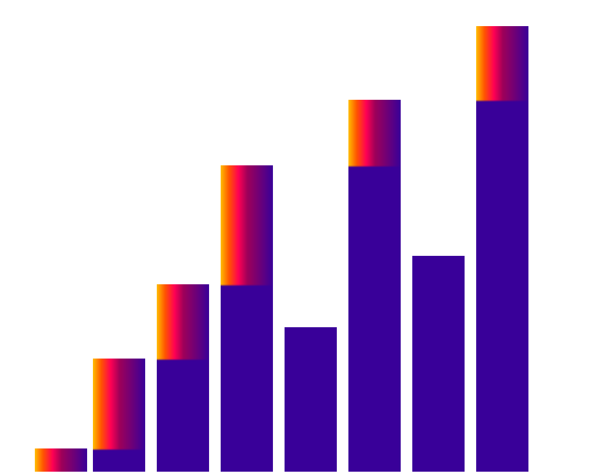
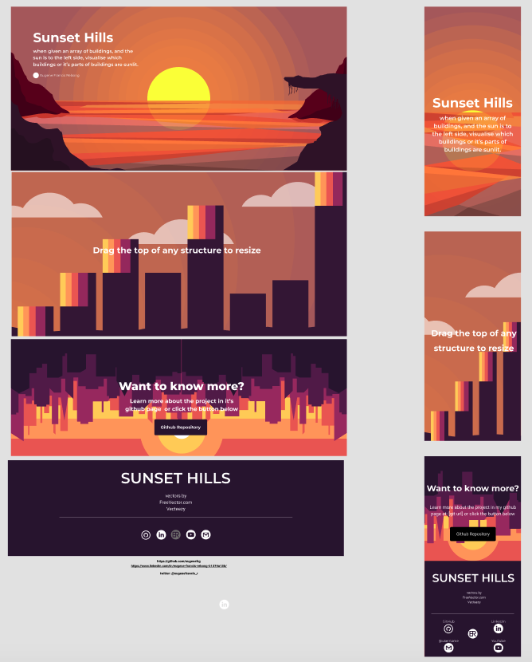

# Coding Challenge: Sunset Hills

**Introduction** this is a personal challenge for myself, and I found this challenge somewhere (I actually lost the link) in YouTube.          
The rules of this is that there is a set of columns, and the sun is setting in the west.

> *Edit (7/1/2021 1:41AM): Just found the video by digging through my YouTube watch history way back at June 23 at 8:42 AM. I was barely listening at the time, but this one coding challenge was actually called Sunset Hills ( which is what I'll now rename this project accordingly) I kinda got the idea of the mechanics right, but the challenge did not need to have resizable columns, instead inputs to the columns. But since I have no time-limit, I could just keep working on improving this project. Link [here](https://www.youtube.com/watch?v=zbwbhDp2kXw). this is Coder Foundry's Video: 5 Javascript Programming Projects To Supercharge Your Portfolio where this is the third.*

**Motivations** after years of deleting everything I make on GitHub because of being ashamed of what it looks like, I am going to change my ways. My mindset was that I have to be putting out things as perfect, but now I believe I can just keep updating this as if it was a seed, and that it will grow eventually to be a beautiful plant      
I am looking to maintain this project long term, continuously working on making it beautiful in time.    
Being able to finish this project is going to be a great achievement for myself.    
As of writing, I have been avoiding canvas for a long time, and I want to actually understand it.

**Wireframe** https://www.figma.com/file/Kx0MhtUO3BFTRgib7pOijq/Sunset-Valley?node-id=0%3A1

**Project Preview** [eugenefrg-sunset-hills.netlify.app](https://eugenefrg-sunset-hills.netlify.app)

**How to run project**

npm install npm start

**To Do**
- [x] Prototype of the towers with lighting
- [x] A Wireframe at least
- [x] Color Scheme for towers
- [x] to create towers depending on screen size
- [x] Color Scheme  for entire website
- [x] low-fi drawings of what I imagine it should look like
- [x] Hero Page  component
- [x] Main Content component
- [x] CTA Component
- [x] Footer Component
- [ ] UI Animations
- [ ] Mobile Responsive

**Progress**
* **July 1, 2021**        
  Moved from using just a div with react-rnd elements and used canvas.        
  Took a while to get used to, and learn, especially the quirks of the coloring on it, but I am quite satisfied with it.        
  I think the experience on canvas is much smoother than it was on just the normal divs that can be resized.        
  Using react-rnd is not very complicated at first, but it gets harder to scale up especially when I started adding a hero-page.        
  By using canvas, It can be placed anywhere and the coordinates are only within the canvas element (although I still have not fully understood it)        
  One disadvantage that made it difficult is the lack of debugging tools, where I had to make my own way of testing things. One is by creating points in the canvas so I could visualize where the gradients are being applied.        
  Also that canvasContent.tsx became a monstrosity of code. Looking to change that soon to make it more understandable.      
  

**July 2, 2021**      
I've decided to take a break from coding for a while, and instead do some designing with the most of my ability.
I think it turned out OK

**July 3, 2021**      
Done the designing of at least just the colors , images and UI. Also managed to put in the dynamic generation of towers depending on the size. I have removed some elements from figma that I did not think was necessary, like the youtube, and email links, but I added a twitter username there. All seems to work nice on Desktop view at 1440x900. I'm looking to just have two breakpoints here, mobile and desktop.
